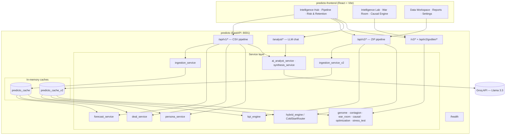

<div align="center">

# Predicto

### AI-Powered Revenue Intelligence Platform

*From raw sales and RevOps data to executive-grade forecasts, risk signals, and strategic recommendations.*

[](https://fastapi.tiangolo.com/)
[](https://react.dev/)
[](https://www.python.org/)
[](https://vitejs.dev/)
[](https://groq.com/)

</div>

---

## Overview

Predicto is a **monorepo** B2B SaaS revenue intelligence platform. It ingests CRM, marketing, and customer health data, normalizes it into a universal schema, trains ML models at ingest time, and serves forecasts, deal scoring, churn warnings, expansion recommendations, and LLM-generated executive narratives through a React dashboard.

The codebase has evolved through two API generations:

| Generation | Data input | Cache | Primary use |
|------------|------------|-------|-------------|
| **V1** | Single CSV upload | `predicto_cache` | Classic revenue forecasting, margin scoring, personas, SSE synthesis |
| **V2** | ZIP of up to 5 CSV tables | `predicto_cache_v2` | RevOps KPIs, hybrid GRU forecasting, AI innovations, god-tier analytics |

There is **no persistent database**. All state lives in in-memory singleton caches and is rebuilt on each ingestion. Pydantic v2 models define all API contracts.

---

## Architecture



**Request flow:** Upload data → schema validation / degradation → feature engineering → model training → cache hydration → API responses served from cache (no per-request retraining).

---

## Repository Structure

```
Predicto/
├── predicto/                          # Python backend (FastAPI)
│   ├── main.py                        # App factory, CORS, router mounting
│   ├── requirements.txt
│   ├── .env.example
│   ├── data/                          # Sample CSV storage (gitignored uploads)
│   └── app/
│       ├── api/
│       │   ├── v1/
│       │   │   ├── data_router.py     # CSV ingest, forecast, personas, deals, report
│       │   │   └── synthesis_router.py # LLM synthesis (SSE)
│       │   └── v2/
│       │       ├── ingestion.py       # ZIP ingest + data health
│       │       ├── intelligence.py    # RevOps KPIs + Intelligence Hub
│       │       ├── deals.py           # Deal priority scorer
│       │       ├── churn.py           # Competitive churn warnings
│       │       ├── expansion.py       # Expansion candidates
│       │       ├── analyst.py         # Explain / chat / root-cause
│       │       ├── godtier2.py        # Cohort fingerprint, rep playbooks, campaign ROI
│       │       ├── godtier_v3_router1.py  # Genome, contagion, war room, stress test
│       │       ├── phase5_router.py   # Topology optimizer, causal counterfactual
│       │       └── godtier.py         # Cliff detector + simulator (not mounted)
│       ├── core/
│       │   ├── config.py              # pydantic-settings singleton
│       │   ├── cache.py               # predicto_cache + predicto_cache_v2
│       │   ├── lifespan.py            # Startup ingestion hook
│       │   └── schema_resolver.py     # V2 canonical column alignment
│       ├── ml/
│       │   ├── forecasting.py         # V1: Fourier + Ridge (Prophet-equivalent)
│       │   ├── margin_engine.py       # V1: XGBoost margin scoring
│       │   ├── segmentation.py        # V1: K-Means personas
│       │   ├── context_builder.py     # ML → LLM context packet
│       │   └── hybrid_engine.py       # V2: GRU + XGBoost cold-start router
│       ├── models/
│       │   ├── schemas.py             # V1 Pydantic contracts
│       │   ├── response_models.py     # V2 Pydantic contracts
│       │   └── response_models_phase5.py
│       └── services/                  # Business logic (20+ modules)
│
└── predicto-frontend/                 # React + TypeScript/JavaScript UI
    ├── src/
    │   ├── router.tsx                 # React Router 7, onboarding gate
    │   ├── api/                       # v1 + v2 API clients
    │   ├── views/                     # Feature pages
    │   ├── components/shell/          # AppShell, sidebar, top bar
    │   ├── hooks/                     # TanStack Query mutations
    │   ├── store/                     # Zustand user state
    │   └── i18n                       # English + Arabic (RTL)
    └── public/locales/                # en + ar translation files
```

---

## Services

| Service | Role |
|---------|------|
| **predicto** (backend) | Single FastAPI process; all ML training and API serving |
| **predicto-frontend** | SPA dashboard; talks to backend via REST (+ SSE for synthesis) |

There are no separate workers, queues, or microservices. Deployment is a backend process plus a static frontend build.

---

## Tech Stack

| Layer | Technologies |
|-------|--------------|
| **Frontend** | React 19, Vite 8, React Router 7, TanStack Query 5, Zustand, Tailwind CSS 4, Recharts, Tremor, Framer Motion, i18next (EN/AR) |
| **Backend** | FastAPI, Uvicorn, Pydantic v2, pydantic-settings |
| **ML / Stats** | scikit-learn, XGBoost, SciPy, Prophet (listed), PyTorch (V2 hybrid GRU), pandas, numpy |
| **Graph / Optimization** | NetworkX (contagion), SciPy HiGHS/MILP (topology optimizer) |
| **LLM** | Groq API — `llama-3.3-70b-versatile` |
| **Storage** | In-memory only (no SQLAlchemy, no migrations) |
| **Deployment** | Vercel (frontend), Render (backend) — documented below |

---

## Data & Models

### Persistence

Predicto does **not** use a relational database. State is held in:

- **`predicto_cache`** (V1): `raw_df`, `monthly_df`, forecast/margin/segmentation models
- **`predicto_cache_v2`** (V2): five raw tables, `engineered_df`, `ColdStartRouter`, degradation log, health score

### Pydantic model families

| File | Purpose |
|------|---------|
| `app/models/schemas.py` | V1: health, ingest, forecast, personas, deal score, synthesis, errors |
| `app/models/response_models.py` | V2: RevOps KPIs, intelligence hub, churn, expansion, deal priority, god-tier features |
| `app/models/response_models_phase5.py` | Phase 5 extensions |

### V1 CSV schema (required columns)

`Order ID`, `Order Date`, `Customer`, `Segment`, `Region`, `Product`, `Sales`, `Quantity`, `Discount`

Optional: `Industry`, `Profit`

### V2 ZIP tables (auto-classified by filename)

| Table key | Typical filename keywords |
|-----------|-------------------------|
| `snapshots` | snapshot, contract_snapshot, customer_contract |
| `product` | product |
| `sales` | sales, crm, deal |
| `marketing` | marketing, campaign, mkt |
| `attribution` | attribution, attr, deal_attribution |

Missing tables trigger schema degradation (imputation) rather than hard failure; a 0–100 `health_score` reflects completeness.

---

## AI & ML Features

### V1 — Three ML pillars + LLM synthesis

| Feature | Engine | Module |
|---------|--------|--------|
| Revenue forecasting | Fourier harmonics + Ridge regression (Prophet-equivalent) | `ml/forecasting.py` |
| Deal margin scoring | XGBoost regressor (GBR fallback) | `ml/margin_engine.py` |
| Customer personas | K-Means (k=4) on customer aggregates | `ml/segmentation.py` |
| Executive synthesis | Groq streaming SSE, ≤600-token context packet | `synthesis_service.py` |

### V2 — Core innovations

| # | Feature | Engine | Service |
|---|---------|--------|---------|
| 1 | Deal Priority Scorer | XGBoost + heuristics | `deal_priority_service.py` |
| 2 | Competitive Churn Warning | GRU hybrid / cold-start XGBoost | `churn_expansion_service.py` |
| 3 | Revenue Expansion Recommender | Clustering + rules | `churn_expansion_service.py` |
| 4 | Revenue Cliff Detector | GRU trajectories + ANOVA | `cliff_detector_service.py` *(router disabled)* |
| 5 | Scenario Simulator | Multi-lever MRR projection | `simulator_service.py` *(router disabled)* |
| 6 | Cohort Lifecycle Fingerprint | linregress + K-Means | `fingerprint_service.py` |
| 7 | Rep Playbook Generator | Win-rate decomposition | `rep_playbook_service.py` |
| 8 | Campaign ROI Decomposer | Monte Carlo Shapley | `roi_decomposer_service.py` |
| 9 | Revenue Genome | DBSCAN + topological data analysis lens | `genome_service.py` |
| 10 | Contagion Network | NetworkX BFS propagation | `contagion_service.py` |
| 11 | Deal War Room | CFR game-theory solver + Pareto front | `war_room_service.py` |
| 12 | Forecast Stress Test | Ridge VAR + Monte Carlo shocks | `stress_test_service.py` |
| 13 | Topology Optimizer | Multi-objective LP (SciPy HiGHS) | `optimization_service.py` |
| 14 | Causal Counterfactual | Double ML (DML) CATE estimation | `causal_counterfactual_service.py` |

### LLM integrations (Groq)

| Endpoint | Capability |
|----------|------------|
| `POST /api/v1/synthesise` | Streaming executive summary (SSE) |
| `POST /api/v1/ai/analyze` | Structured AI analysis |
| `POST /analyst/explain` | Entity-level root-cause narrative |
| `POST /analyst/chat` | Multi-turn portfolio chat |
| `POST /analyst/root-cause` | Portfolio executive narrative |

All analyst endpoints return safe fallback text when `GROQ_API_KEY` is unset.

### V2 hybrid engine

`ColdStartRouter` in `hybrid_engine.py` selects:

- **Lite model** (XGBoost) when engineered rows &lt; 1,000
- **Full model** (GRU + XGBoost) at scale

---

## API Reference

**32 REST endpoints** plus **1 SSE stream**. Interactive docs: `http://localhost:8001/docs`

> **Route prefix note:** Most V2 routes use `/api/v2/...`. Exceptions: `godtier2` uses `/v2/...`; the analyst router uses `/analyst/...` (no `/api` prefix). `godtier.py` (cliff detector + simulator) exists but is **not mounted** in `main.py`.

### Health

| Method | Path | Description |
|--------|------|-------------|
| `GET` | `/health` | Liveness: `models_ready`, `data_loaded`, uptime |
| `GET` | `/api/v2/data/health` | V2 cache health, AI module status map |
| `GET` | `/api/v2/godtier/phase5/health` | Phase 5 feature availability |

### V1 — CSV pipeline (`/api/v1`)

| Method | Path | Description |
|--------|------|-------------|
| `POST` | `/api/v1/ingest` | Upload CSV, validate schema, train V1 pillars |
| `GET` | `/api/v1/forecast` | Segment revenue forecast (`?periods=N`) |
| `GET` | `/api/v1/personas` | K-Means persona summary |
| `POST` | `/api/v1/deals/score` | Score a hypothetical deal |
| `GET` | `/api/v1/revenue/overview` | Revenue KPI overview |
| `GET` | `/api/v1/transactions` | Paginated transaction table |
| `GET` | `/api/v1/preview` | Data preview |
| `GET` | `/api/v1/data/preview` | Alternate data preview |
| `GET` | `/api/v1/report` | Printable executive HTML report |
| `POST` | `/api/v1/ai/analyze` | Structured AI analysis |
| `POST` | `/api/v1/synthesise` | **SSE** — streaming executive summary |

### V2 — ZIP pipeline & intelligence (`/api/v2`)

| Method | Path | Description |
|--------|------|-------------|
| `POST` | `/api/v2/data/preview` | Preview ZIP contents before ingest |
| `POST` | `/api/v2/data/ingest` | Ingest ZIP, train hybrid engine |
| `GET` | `/api/v2/revops/kpis` | Seven RevOps KPIs (FAV, RER, EDI, SBS, ORC, CQS, RSFS) |
| `GET` | `/api/v2/intelligence/hub` | Executive dashboard bundle |
| `GET` | `/api/v2/deals/priority` | AI-ranked deal priority list |
| `GET` | `/api/v2/churn/competitive` | Competitive churn warnings |
| `GET` | `/api/v2/expansion/candidates` | Expansion opportunity candidates |

### V2 — God-tier intelligence (`/api/v2/godtier` + `/v2`)

| Method | Path | Description |
|--------|------|-------------|
| `GET` | `/v2/cohorts/lifecycle-fingerprint` | Cohort lifecycle archetypes |
| `GET` | `/v2/attribution/rep-playbook` | Rep-level win-rate playbooks |
| `GET` | `/v2/attribution/campaign-roi-decomposer` | Multi-touch campaign ROI |
| `GET` | `/api/v2/godtier/portfolio/genome` | Revenue genome topology |
| `GET` | `/api/v2/godtier/portfolio/contagion-network` | Churn contagion graph |
| `GET` | `/api/v2/godtier/deals/war-room` | Deal negotiation war room |
| `POST` | `/api/v2/godtier/forecast/stress-test` | Macro shock stress test |
| `POST` | `/api/v2/godtier/optimization/topology` | Resource allocation optimizer |
| `GET` | `/api/v2/godtier/causal/counterfactual` | DML causal treatment effects |

### V2 — AI Analyst (`/analyst`)

| Method | Path | Description |
|--------|------|-------------|
| `POST` | `/analyst/explain` | Entity root-cause explanation |
| `POST` | `/analyst/chat` | Portfolio-aware chat |
| `POST` | `/analyst/root-cause` | Portfolio executive narrative |

### Disabled (implemented, not mounted)

| Method | Path | Module |
|--------|------|--------|
| `POST` | `/api/v2/forecast/revenue-simulator` | `godtier.py` |
| `GET` | `/api/v2/risk/revenue-cliff-detector` | `godtier.py` |

---

## Frontend Views

| Route | View | Backend APIs |
|-------|------|--------------|
| `/intelligence-hub` | Executive KPIs, risk summary, action queue | `/api/v2/intelligence/hub` |
| `/pipeline` | Deal priority, margin scoring | `/api/v2/deals/priority`, `/api/v1/deals/score` |
| `/risk-retention` | Churn, expansion, contagion, stress scenarios | churn, expansion, godtier |
| `/intelligence-lab` | Feature hub | — |
| `/intelligence-lab/causal-engine` | Causal counterfactual explorer | `/api/v2/godtier/causal/counterfactual` |
| `/intelligence-lab/topology-optimizer` | Resource allocation LP | `/api/v2/godtier/optimization/topology` |
| `/war-room` | Deal negotiation advisor | `/api/v2/godtier/deals/war-room` |
| `/data-workspace` | ZIP upload, preview, degradation log | `/api/v2/data/*` |
| `/reports` | Executive report download | `/api/v1/report` |
| `/settings` | Profile, language (EN/AR), diagnostics | — |

Onboarding collects a display name before entering the shell. Arabic locale enables RTL layout.

---

## Quick Start

### Prerequisites

- Python 3.10+
- Node.js 18+
- [Groq API key](https://console.groq.com) (required for LLM features)

### 1. Backend

```bash
cd predicto
python -m venv .venv

# Windows
.venv\Scripts\activate
# macOS / Linux
source .venv/bin/activate

pip install -r requirements.txt

# V2 hybrid engine also requires (not in requirements.txt):
pip install torch networkx

copy .env.example .env   # Windows
# cp .env.example .env   # macOS/Linux
```

Edit `predicto/.env`:

```env
GROQ_API_KEY=your_key_here
LOAD_DEFAULT_CSV_ON_STARTUP=false
```

By default the server starts with an **empty cache** until you upload data via the API or Data Workspace.

### 2. Frontend

```bash
cd predicto-frontend
npm install
```

Create `predicto-frontend/.env.local`:

```env
VITE_API_URL=http://localhost:8001
```

### 3. Run

**Terminal 1 — Backend:**

```bash
cd predicto
source .venv/bin/activate   # or .venv\Scripts\activate
uvicorn main:app --reload --port 8001
```

**Terminal 2 — Frontend:**

```bash
cd predicto-frontend
npm run dev
```

Open [http://localhost:5173](http://localhost:5173). Upload data via **Data Workspace** (V2 ZIP) or `POST /api/v1/ingest` (V1 CSV).

> **First ingest:** V2 ZIP ingestion trains the hybrid engine and may take 10–30 seconds depending on data size. Subsequent API calls read from cache.

---

## Environment Variables

### Backend (`predicto/.env`)

| Variable | Default | Description |
|----------|---------|-------------|
| `GROQ_API_KEY` | *(empty)* | Groq API key for LLM endpoints |
| `LOAD_DEFAULT_CSV_ON_STARTUP` | `false` | If `true`, ingest bundled CSV at startup |
| `PORT` | `8001` | HTTP port (set by Render in production) |
| `ENV` / `environment` | `development` | `development` \| `staging` \| `production` |

Settings are loaded via `app/core/config.py` (pydantic-settings). CORS allows `http://localhost:5173` and `http://localhost:3000` by default.

### Frontend (`predicto-frontend/.env.local`)

| Variable | Default | Description |
|----------|---------|-------------|
| `VITE_API_URL` | `http://localhost:8001` | Backend base URL |

---

## Deployment

### Frontend → Vercel

```bash
cd predicto-frontend
npm run build
```

Set `VITE_API_URL` to your production backend URL in the Vercel dashboard.

### Backend → Render

| Setting | Value |
|---------|-------|
| Build command | `pip install -r requirements.txt && pip install torch networkx` |
| Start command | `uvicorn main:app --host 0.0.0.0 --port $PORT` |
| Environment | `GROQ_API_KEY`, optional `LOAD_DEFAULT_CSV_ON_STARTUP` |

**Cold start:** Free-tier hosts may sleep; first request after idle can be slow while models retrain. Poll `GET /health` from the frontend on load.

---

## Development Notes

- **OpenAPI:** Full schema at `/docs` and `/openapi.json` when the backend is running.
- **Graceful degradation:** V2 endpoints return `OFFLINE` / `PARTIAL` confidence levels instead of 500s when tables are missing.
- **No WebSockets:** Real-time LLM output uses **Server-Sent Events** on `/api/v1/synthesise`.
- **`.gitignore`:** Excludes `node_modules/`, `__pycache__/`, `.env`, venvs, and uploaded user data.

---

## License & Contact

Built by **Omar Elsaber** — AI Engineer @ SEG.

[](https://github.com/omarelsaber)
[](https://linkedin.com/in/omarelsaber)
